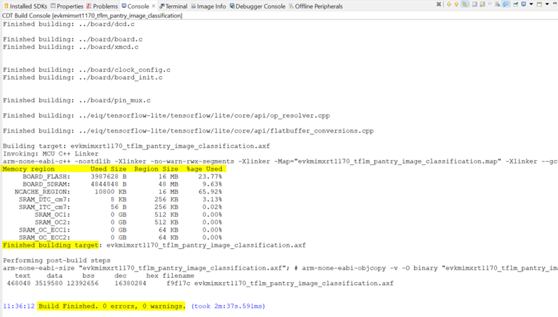

# NXP Application Code Hub

## ML Kitchen Pantry Object Classification

Step-by-step guide for deployment of an object classification model on an MCU-based system. The object classification model is developed by fine-tuning a MobileNet model using transfer learning to classify common kitchen pantry items. 

This classification model was trained on kitchen pantry objects, namely Canned tomatoes, Ketchup, Mayonnaise, Paper towels, Sugar and Tomato sauce. It was compiled using the Adam optimizer and a Categorical Cross-entropy loss function over 20 epochs. The provided saved model is an int8 quantized tflite model, with an accuracy of ~88% with a small dataset of 182 images. 

The object classification model is deployed on RT1170-EVK which is an evaluation board, equipped with a 1GHz Arm Cortex-M7 core as well as a 400MHz Arm Cortex-M4 core, that is useful for evaluation and protyping using the MCUXpresso suite. The RT1170-EVK board memory consists of a 512 Mbit SDRAM, a 512 Mbit Octal Flash, a 128 Mbit QPSI Flash, a 2 Gbit Raw NAND Flash, a 64 Mbit LPSPI Flash and a TF socket for an SD card. 

#### Boards: MIMXRT1170-EVK
#### Categories: AI/ML, Vision
#### Peripherals: DISPLAY, VIDEO
#### Toolchains: MCUXpresso IDE

## Table of Contents
1. [Software](#step1)
2. [Hardware](#step2)
3. [Software Setup](#step3)
4. [Hardware Setup](#step4)
5. [Results](#step5)
6. [FAQs](#step6) 
7. [Support](#step7)
8. [Release Notes](#step8)

## 1. Software
<!-- ### 1.1 Software Packages   -->
Download and Install [MCUXpresso IDE v11.8.0+](https://www.nxp.com/design/software/development-software/mcuxpresso-software-and-tools-/mcuxpresso-integrated-development-environment-ide:MCUXpresso-IDE). The IDE is an easy-to-use development environment that offers advanced editing, compiling and debugging features for NXP's ARM Cortex-M based MCUs including the RT1170, which will be used for this project. 

## 2. Hardware
- Purchase supported board 
    - [MIMXRT1170-EVK](https://www.nxp.com/design/development-boards/i-mx-evaluation-and-development-boards/i-mx-rt1170-evaluation-kit:MIMXRT1170-EVK)

        The RT1170 is the evaluation board based on the NXP i.MX Rt1170 Processor. It is an entry level development board, that gives developers an option to be familiar with the processor before investing resources in more specific designs. 

        The EVK contents include an i.MXrt1170 EVK board, a 5V power adaptor, an OV5640 MIPI camera module, a USB cable (Micro B).
    
        
    - 0V5640 MIPI camera module (comes with EVK board). One MIPI CSI is supported by the i.MX RT1170, and there is a camera module connector (J2) on the EVK board. 
    
        

- Purchase supported display 
    - [RK055HDMIPI4MA0](https://www.nxp.com/part/RK055HDMIPI4MA0#/). This is a 5.5" LCD panel that can work with several i.MX RT EVKs, including the RT1170 EVK, for evaluation of applications with display.
    
    
    

## 3. Software Setup
### 3.1
Import the project into MCUXpresso IDE by following the following sections of the "MCUXpresso IDE - User Guide" found in the documentation section of [the MCUXpresso IDE page](https://www.nxp.com/design/software/development-software/mcuxpresso-software-and-tools-/mcuxpresso-integrated-development-environment-ide:MCUXpresso-IDE): 

### 3.2
*Section 10.3: Importing an Example Project*. 

This section covers the steps to import the attached project to the IDE. The ML Object Classification directory needs to be downloaded first to import it from your file system. 
<!-- **Section 4.2.4** *Installing SDKs by Importing a Remote SDK Git Repository* or **Section 4.2.5** *Installing SDKs by Importing a Local Clone of an SDK Git Repository* -->

<!-- ### 3.2
**Section 6** *Importing Example Projects (from installed SDKs)* -->

### 3.3
Switch to release build (directions on this are in *Section 21.2* of the MCUXpresso User Guide) and then follow *Section 5.2: Project Build* to build the imported project..
After building, the following should be printed in the *Console* tab (typically at the bottom of the screen). 

### 3.4 
*Section 13: Debugging a Project* 

This chapter is an overview of many of the debug features supported by the debug solutions in the MCUXpresso IDE. Debug operations require a physical connection between the host computer and RT1170 EVK via a debug probe (more on that in the chapter).  

### 3.5
*Section 21.8: Using Terminal View for UART communication with target*

UART (serial) input/output between your host PC and the RT1170 EVK can be displayed using the terminal view provided by the MCUXpresso IDE. 

## 4. Hardware Setup 
Attach the LCD to J48, on the back of the board 

Attach the camera to J2, next to the ethernet port J4. 

## 5. Results
After debugging and running (F8 or *Resume* icon at top of page) the project, the inferencing results of the input captured by the MIPI camera should be displayed in the terminal and on the LCD as shown below. Sample images from all six classes are also shown below.  

<!--  -->
<!--  -->

## 6. FAQs
No FAQs have been identified for this project.

## 7. Support
#### Project Metadata
<!----- Boards ----->

<!----- Categories ----->
 

<!----- Peripherals ----->
 

<!----- Toolchains ----->

Questions regarding the content/correctness of this example can be entered as Issues within this GitHub repository.

>**Warning**: For more general technical questions regarding NXP Microcontrollers and the difference in expected funcionality, enter your questions on the [NXP Community Forum](https://community.nxp.com/)

## 8. Release Notes
| Version | Description / Update                           | Date                        |
|:-------:|------------------------------------------------|----------------------------:|
| 1.0     | Initial release on Application Code Hub        | August 30th 2023 |

